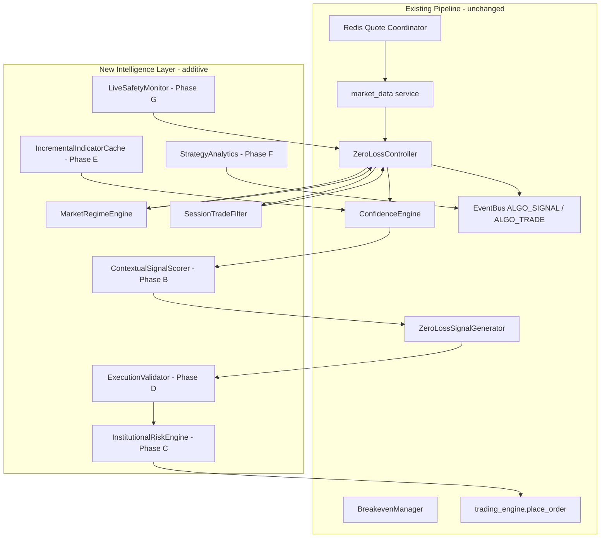
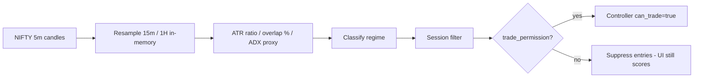
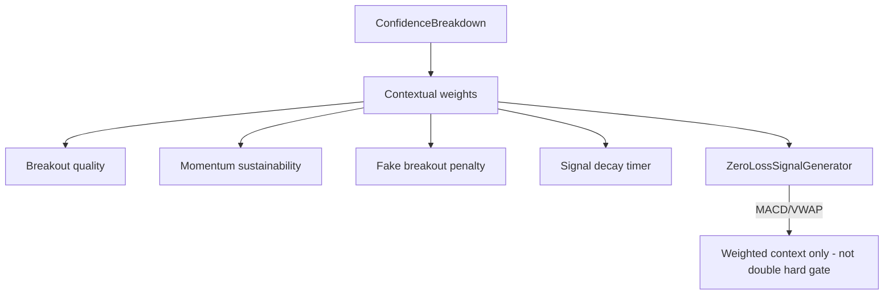
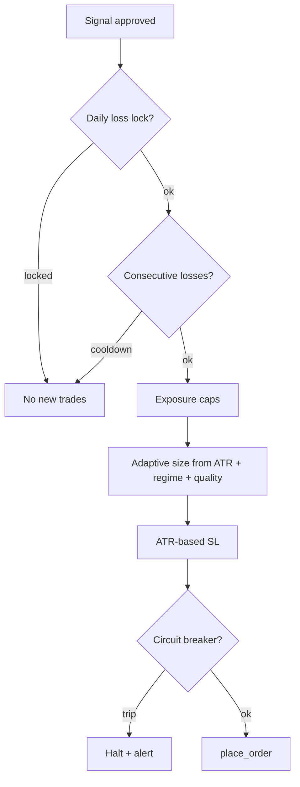
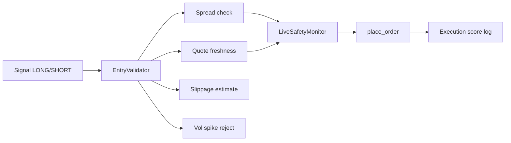
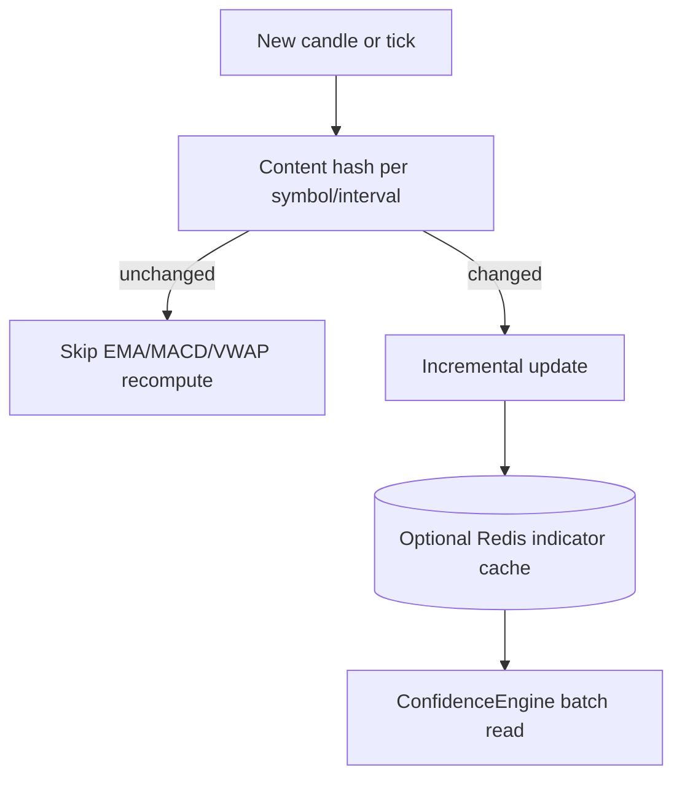

# Alpha Auto Engine — Institutional Upgrade Plan

Additive intelligence layer on `backend/strategies/zeroloss/` without replacing execution, Redis quotes, EventBus, WebSocket, or frontend layout.

---

## 1. Architecture overview



**Principle:** Intelligence modules return scores, permissions, and size multipliers. The controller applies them as **gates and modifiers** before calling existing `place_order`.

---

## 2. New module structure

```
backend/strategies/zeroloss/
├── controller.py              # orchestrator (wires intelligence hooks)
├── confidence_engine.py     # unchanged scoring base
├── signal_generator.py      # gates softened via Phase B scorer
├── breakeven_manager.py
├── intelligence/
│   ├── __init__.py
│   ├── ARCHITECTURE_UPGRADE.md
│   ├── market_regime_engine.py      # Phase A ✅
│   ├── session_filters.py           # Phase A ✅
│   ├── contextual_signal_scorer.py  # Phase B (planned)
│   ├── institutional_risk_engine.py # Phase C (planned)
│   ├── execution_validator.py       # Phase D (planned)
│   ├── indicator_cache.py           # Phase E (planned)
│   ├── strategy_analytics.py        # Phase F (planned)
│   └── live_safety_monitor.py       # Phase G (planned)
```

---

## 3. Market regime workflow (Phase A)



**Outputs (API via `get_stats().regime_intelligence`):**

| Field | Purpose |
|-------|---------|
| `market_quality_score` | 0–100 environment quality |
| `trade_permission` | Master additive gate |
| `regime` | TRENDING, SIDEWAYS_CHOP, BREAKOUT_EXPANSION, etc. |
| `htf_1h / htf_15m / htf_5m` | Multi-timeframe alignment |
| `suppress_reasons` | Auditable block list |

**Legacy preserved:** `_market_regime` (BULLISH/BEARISH/NEUTRAL) from EMA spread unchanged.

---

## 4. Signal engine refactor workflow (Phase B)



**Rules:**

- MACD and VWAP contribute once in confidence; generator uses **composite score** not duplicate binary gates.
- High conviction (≥70) still bypasses soft penalties.
- Signal decay: `effective_score = raw * exp(-age_minutes / half_life)`.

---

## 5. Risk flow diagram (Phase C)



**Planned limits:**

- Daily max loss % (config per user)
- Consecutive loss cooldown (N losses → M minutes)
- Per-symbol and sector correlation caps
- Directional exposure (net long vs short notional)

---

## 6. Execution safety workflow (Phase D + G)



**Live safety (Phase G):** WS lag, Redis lag, quote desync, chaos detection, API degradation → `recovery_state` on controller.

---

## 7. Scalability (Phase E)



**Targets:** batched scan scheduler, shared cache key `zl:ind:{symbol}:{interval}`, 1000+ symbols with bounded CPU.

---

## 8. Strategy analytics (Phase F)

Persist to DB / Redis aggregates:

- Win rate by `regime`
- PnL by volatility bucket
- False breakout count
- Hour-of-day heatmap
- Confidence vs realized R

Expose via existing ZeroLoss API routes (new `/analytics` sub-resource) — **no frontend layout change**, optional new panel later.

---

## 9. Incremental implementation plan

| Phase | Scope | Risk | Status |
|-------|--------|------|--------|
| A | MarketRegimeEngine + session filters + controller gate | Low | **Implemented** |
| B | ContextualSignalScorer; soften MACD/VWAP duplicate gates | Medium | Planned |
| C | Daily loss lock, ATR sizing, exposure caps | Medium | Planned |
| D | Pre-order ExecutionValidator | Low | Planned |
| E | IndicatorCache incremental | Medium | Planned |
| F | Analytics persistence + API | Low | Planned |
| G | LiveSafetyMonitor hooks | Medium | Planned |

**Order rationale:** Regime and session filters reduce bad trades immediately; risk and execution before scale; analytics last.

---

## 10. Safe migration strategy

1. **Feature flags** on controller: `_use_regime_intelligence`, `_use_contextual_signals`, `_use_institutional_risk` (default `True` only for A after soak).
2. **Shadow mode (optional):** Log `would_block` without blocking for 1 session; compare PnL.
3. **Stats-only rollout:** Expose `regime_intelligence` in `get_stats()` / WebSocket payload; UI reads if present (backward compatible).
4. **No Redis schema break:** New keys prefixed `zl:intel:` optional.
5. **Rollback:** Set `_use_regime_intelligence = False` — instant revert to legacy-only gates.

---

## 11. Backward compatibility

| Component | Compatibility |
|-----------|----------------|
| `_market_regime` | Unchanged EMA logic |
| `place_order` | Unchanged signature |
| EventBus events | Same types; extra fields in `stats` only |
| Confidence UI | Still receives `confidence_update` |
| Thresholds | Existing `_threshold` / NEUTRAL_REGIME_THRESHOLD remain |
| Simulation mode | Intelligence gates bypassed in sim |

---

## 12. Controller integration points (current)

```text
_update_market_regime()
  → MarketRegimeEngine.evaluate()
  → SessionTradeFilter.evaluate()

_scan_for_signals()
  → can_trade &= _institutional_trade_allowed()

get_stats()
  → regime_intelligence: snapshot dict
```

Future hooks (same pattern):

```text
_signal_gen.generate() → contextual scorer adjust
_compute_quantity()   → risk_engine.size_multiplier()
_place_trade()        → execution_validator.validate()
```

---

## 13. Configuration (recommended env / settings)

```python
ZEROLOSS_INTEL_REGIME = true
ZEROLOSS_DAILY_MAX_LOSS_PCT = 2.0
ZEROLOSS_MAX_CONSECUTIVE_LOSSES = 3
ZEROLOSS_MIN_MARKET_QUALITY = 42
```

---

*Last updated: Phase A wired in controller; Phases B–G documented for sequential delivery.*
