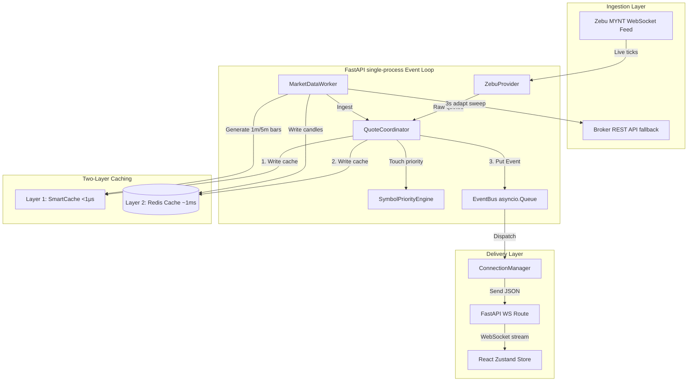

# AlphaSync Technical Architecture: Data Pipeline & Low-Latency Price Feed

> **Note**: This document focuses on the real-time data pipeline and caching design.  
> For the full system architecture, see [ARCHITECTURE.md](./ARCHITECTURE.md).  
> **Workspace path**: `d:\VIANMAX DEV TEAM\GITHUB - DEMO001\NEW MODULE - ALPHASYNC\3\demo.001`

This document provides a comprehensive technical breakdown of the **AlphaSync** architecture, focusing on the real-time data pipeline, broker WebSocket integration, PostgreSQL schema, Redis deployment, and the two-layer caching strategy.

---

## 1. End-to-End Real-Time Data Pipeline

The data pipeline handles ingestion, normalization, caching, and distribution of market data (Equity quotes, Indices, Futures & Options, and Commodities).



### A. Stocks & Indices Price Flow
1. **Subscription Registration**:
   - When a user views a stock or adds it to their watchlist, the frontend React app sends a `subscribe` action via WebSocket.
   - The backend `ConnectionManager` (in [manager.py](file:///d:/VIANMAX%20DEV%20TEAM/GITHUB%20-%20DEMO001/NEW%20MODULE%20-%20ALPHASYNC/3/demo.001/backend/websocket/manager.py)) registers the connection ID under that symbol.
   - It forwards the subscription request to the active broker websocket session via `ZebuProvider` (in [zebu_provider.py](file:///d:/VIANMAX%20DEV%20TEAM/GITHUB%20-%20DEMO001/NEW%20MODULE%20-%20ALPHASYNC/3/demo.001/backend/providers/zebu_provider.py)).
2. **Ingestion & Tick Parsing**:
   - The `ZebuProvider` maintains a persistent WebSocket connection to the broker (`wss://go.mynt.in/NorenWSTP/`).
   - Ticks arrive as JSON messages (type `tk` or `tf`). In `_handle_tick`, fields (LTP `lp`, open `o`, high `h`, low `l`, volume `v`, closing `c`, best bid/ask `bp1`/`sp1`) are extracted and normalized to canonical keys.
   - Ticks are sent to the `QuoteCoordinator` singleton (`ingest_equity_quote`).
3. **Internal Egress**:
   - The `QuoteCoordinator` updates the process-local `SmartCache` and writes the quote to Redis.
   - An event of type `PRICE_UPDATED` is placed on the backend `EventBus` (`asyncio.Queue`).
   - The `ConnectionManager` listens to the event bus and broadcasts the updated quote over the client WebSocket connection.

### B. Chart Candles (OHLCV) Generation & Fallback
- **Live Candle Aggregation**:
  - The `MarketDataWorker` background task (in [market_worker.py](file:///d:/VIANMAX%20DEV%20TEAM/GITHUB%20-%20DEMO001/NEW%20MODULE%20-%20ALPHASYNC/3/demo.001/backend/workers/market_worker.py)) aggregates raw ticks into 1-minute and 5-minute candles.
  - In `_update_interval_candle`, the worker updates the high/low/close prices and computes the cumulative volume based on incoming ticks.
  - The candles are buffered in-memory (`self._history_buffers`) and persisted to Redis every 15 seconds (`set_history`).
- **Index Volume Proxy (Proxy Aggregation)**:
  - Spot index quotes (like Nifty 50 `^NSEI` or Bank Nifty `^NSEBANK`) do not carry transaction volumes from the spot feed ($volume=0$).
  - When the frontend requests historical charts via `/api/market/history/{symbol}`, the backend service handles volume mapping in `_enrich_index_candles_with_futures_volume`.
  - It queries the **near-month liquid futures contract** (e.g., `NIFTY` futures for `^NSEI`) from the `futures_contract_registry` and copies its traded volumes onto the index spot candles. This ensures index charts render with accurate volume indicators.
- **Failover / Cache Warm-Start**:
  - On backend startup, `MarketDataWorker` performs `_hydrate_history_from_redis` to reload past candles, ensuring a service reboot doesn't wipe active charts.
  - If the live broker API/WebSocket fails during a history request, the API route (`get_history` in [market.py](file:///d:/VIANMAX%20DEV%20TEAM/GITHUB%20-%20DEMO001/NEW%20MODULE%20-%20ALPHASYNC/3/demo.001/backend/routes/market.py)) falls back to `_get_redis_history_fallback` to serve cached data.

### C. F&O Contracts and Options Chains
- **F&O Tick Distribution**:
  - Ticks for derivative contracts (NFO/BFO exchanges) carry contract specific parameters like Open Interest (`oi`).
  - When derivative ticks are received in `ZebuProvider._handle_tick`, the provider emits a specialized `FUTURES_QUOTE` event.
  - The `ConnectionManager` listens to this event and broadcasts the message type `futures_quote` to the frontend.
  - On the client side, the Zustand store `useUnifiedFuturesStore` captures the quote, updates the open positions, and automatically recalculates realized/unrealized P&L in real-time.
- **Option Chains**:
  - Option chain quotes are mirrored in the market store so the options visualizer updates prices, spreads, and implied values dynamically without lag.

### D. Header Ticker Price
- The header ticker contains indices, popular stocks, and commodities.
- The `MarketDataWorker` builds this list (`_build_ticker_items`) after every sweep cycle.
- The payload is written to Redis under `alphasync:ticker:all`, `alphasync:indices:all`, and `alphasync:commodities:all` with a short TTL (10 seconds).
- The frontend (via `useMarketIndicesStore`) polls these endpoints or receives incremental updates, keeping header indicators synchronized.

---

## 2. Ultra-Fast Frontend Updates (Zero-Delay Design)

To deliver price updates to the user interface without delay, the architecture applies four optimization techniques:

### 1. Single-Process AsyncIO Event Loop
FastAPI runs on a single process (`1x UvicornWorker` managed by Gunicorn). 
- All HTTP request handlers, WebSocket connections to users, and broker WebSocket client connections run inside the **same event loop**.
- Because they share the same memory space, ticks are passed from the broker WebSocket client to the user WebSocket servers via direct in-memory calls.
- This bypasses multi-process serialization, inter-process communication (IPC) latency, and CPU context-switching overhead.

### 2. Symbol Priority Engine & Throttling
To prevent the client WebSocket from being flooded during high volatility (which causes UI freezing and browser lockups), the backend uses a priority-based gating system:
- **Tiers**: Symbols are classified as `HOT` (active chart/indices), `WARM` (watchlists), or `COLD` (others).
- **Throttling**: 
  - `HOT` symbols bypass throttling entirely (emitted at `0.0s` delay).
  - `WARM` symbols are throttled to a maximum of 4 updates per second (`0.25s` interval).
  - `COLD` symbols are limited to 1 update per second (`1.0s` interval).
- **Queue Shedding**: If the event bus queue length grows beyond 250 items, the backend drops (`sheds`) updates for `COLD` symbols, preventing message accumulation and latency backlogs.

### 3. Stable React WebSocket Hook (No Reconnect Storms)
The React client connects using a custom hook (in [useWebSocket.js](file:///d:/VIANMAX%20DEV%20TEAM/GITHUB%20-%20DEMO001/NEW%20MODULE%20-%20ALPHASYNC/3/demo.001/frontend/src/hooks/useWebSocket.js)).
- It uses React `useRef` to store stateful parameters (WebSocket connection reference, status, callbacks).
- This keeps the connection state independent of React component re-renders, preventing **reconnect storms** (where rapid UI updates trigger redundant WebSocket reconnects).

### 4. Direct Zustand State Updates
- Incoming price ticks are directly written to the Zustand store (`updateQuote`).
- Zustand triggers state changes in React components without global component re-renders. 
- Custom styles (`.price-up` and `.price-down` in `index.css`) use CSS micro-animations to highlight ticks in green or red.

---

## 3. Two-Layer Cache Architecture

The application implements a two-layer cache hierarchy to optimize read operations:

```
Request 
   │
   ▼
[ Layer 1: SmartCache ] ──(Hit: <1μs)──► Return Data
   │
 (Miss)
   │
   ▼
[ Layer 2: Redis Cache ] ──(Hit: ~1ms)──► Write Layer 1 ──► Return Data
   │
 (Miss)
   │
   ▼
[ PostgreSQL DB / API ] ────────────────► Write Layer 2 & 1 ──► Return Data
```

### Layer 1: Smart Cache (Process-Local In-Memory)
- **File**: [smart_cache.py](file:///d:/VIANMAX%20DEV%20TEAM/GITHUB%20-%20DEMO001/NEW%20MODULE%20-%20ALPHASYNC/3/demo.001/backend/cache/smart_cache.py)
- **Implementation**: Written in Python using an `OrderedDict` to support $O(1)$ Least Recently Used (LRU) cache evictions.
- **Latency**: **< 1 microsecond** ($\mu s$).
- **Role**: Sits directly inside the FastAPI memory heap. It eliminates network round-trips for data that is frequently requested within the same second (such as user portfolio summaries, active order states, and live quotes).
- **TTLs**: Very short (e.g., `quote_cache` is 5s, `portfolio_cache` is 3s, `order_cache` is 2s).

### Layer 2: Redis Cache (Shared Network Cache)
- **File**: [redis_client.py](file:///d:/VIANMAX%20DEV%20TEAM/GITHUB%20-%20DEMO001/NEW%20MODULE%20-%20ALPHASYNC/3/demo.001/backend/cache/redis_client.py)
- **Implementation**: Runs a containerized Redis 7 Alpine instance. Communication uses `redis.asyncio` with a 64-connection pool.
- **Latency**: **~1 millisecond** ($ms$).
- **Role**: Provides a shared caching layer across background workers, API request tasks, and tasks running in the event loop. It maintains system-wide subscriptions, health indicators, and historical candle data.
- **Failover**: All Redis operations are wrapped in error-handling try/catch blocks. If Redis becomes unavailable, the system logs a warning and falls back to fetching directly from PostgreSQL or the broker REST API, ensuring high availability.

---

## 4. Database Schema & Persistence

### PostgreSQL 16 Schema
PostgreSQL is configured as the persistent store of record. The primary database entities include:

1. **Authentication & User Management**:
   - `users`: Core profile details and virtual capital balance (defaulting to ₹10 Lakhs).
   - `two_factor_auth`: Multi-factor TOTP secrets and backup codes.
   - `user_sessions`: Tracks JWT session states using unique JTI (JWT ID) claims, allowing instant session revocation on logout.
2. **Trading Ledger**:
   - `orders`: Stores user orders (MARKET, LIMIT, STOP_LOSS, STOP_LOSS_LIMIT) and tracks state transitions (`PENDING` $\rightarrow$ `OPEN` $\rightarrow$ `FILLED` / `CANCELLED`).
   - `portfolios` & `holdings`: Real-time capital balance, purchase values, and current valuations.
   - `transactions`: Log auditing of all executed buy/sell actions.
3. **Automated Trading & Strategies**:
   - `algo_strategies`, `algo_trades`, `algo_logs`: Stores strategy configurations (e.g. SMA crossovers, RSI boundaries), executed trades, and performance history.
   - `zeroloss_signals` & `zeroloss_performance`: Tracks entry/exit parameters and performance metrics for the cost-breakeven strategy.
4. **Broker Configurations**:
   - `broker_accounts`: Contains authenticated broker session data (encrypted credentials and refresh tokens).

### Broker Credential Security (AES-256-GCM)
To protect user credentials:
- Broker tokens are encrypted before storage using **AES-256-GCM** (Galois/Counter Mode).
- The encryption key is derived using HKDF-SHA256 from the `BROKER_ENCRYPTION_KEY` environment variable.
- For each encryption operation, a random 12-byte initialization vector (nonce) is generated.
- The stored value is format-packed as `base64(nonce + ciphertext + tag)`.

### Redis Key Schema
Redis uses the `alphasync` prefix namespace to manage the following keys:

| Key Pattern | Type | TTL (Active) | TTL (Closed) | Purpose |
| :--- | :--- | :--- | :--- | :--- |
| `alphasync:price:{symbol}` | String (JSON) | 120s | 86,400s (24h) | Standard quote payload |
| `alphasync:price:{symbol}:ts` | String | 120s | 86,400s (24h) | Unix timestamp of the last update |
| `alphasync:last_price:{symbol}` | String (JSON) | Persistent | Persistent | Long-term snapshot for closed-market display |
| `alphasync:price:all` | Hash | Persistent | Persistent | Grouped quotes for batch queries |
| `alphasync:subscriptions` | Set | Persistent | Persistent | Active symbols monitored by the backend |
| `alphasync:history:{sym}:{p}:{i}` | List (JSON) | 7 Days | 7 Days | Aggregated historical candle series |
| `alphasync:provider:status` | String (JSON) | 60s | 60s | Broker WebSocket connection health stats |

---

## 5. Summary of Optimization Decisions

| Objective | Architectural Solution | Rationale |
| :--- | :--- | :--- |
| **No Ingestion Delay** | Co-located Single-process AsyncIO event loop | Bypasses IPC serialization and OS thread context switching. |
| **Zero UI Lag** | Priority-based throttling + Event Queue shedding | Emits active charts instantly; limits watchlists to 4/sec; sheds cold ticks under load. |
| **No API Overhead** | Layer 1 Smart Cache (<1μs lookup time) | Intercepts high-frequency concurrent queries before they hit Redis or PostgreSQL. |
| **Resilient Charts** | Index volume mapping from nearest liquid futures | Solves the problem of spot index quotes returning zero trading volume. |
| **Secure Credentials** | AES-256-GCM encryption with dynamic nonces | Prevents database exposure of broker OAuth tokens. |
| **Stable WebSockets** | React Ref-based connection lifecycle | Eliminates UI re-render reconnect loops. |
